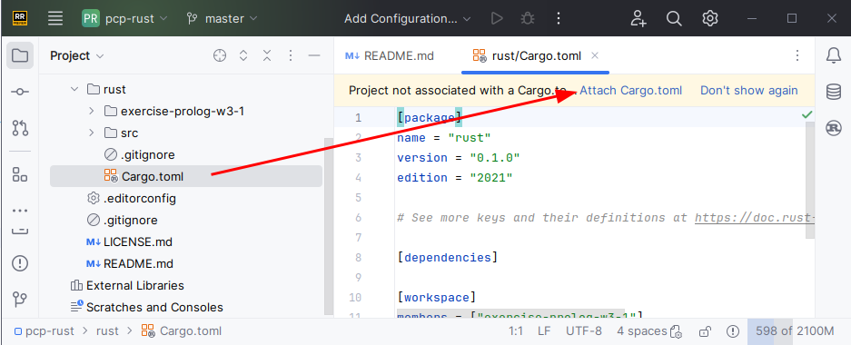

pcp-rust
========

Rust project for PCP @ HSLU 2024 

# Dates and times

| Date       | When | Lecture         | Task                                  |
|------------|------|-----------------|---------------------------------------|
| 2024-04-25 | Thu  | Modern Java I   |                                       |
| 2024-04-26 | Fri  | Modern Java II  | Team & Sprache fixiert                |
| 2024-05-02 | Thu  | Modern Java III |                                       |
| 2024-05-03 | Fri  | Modern Java VI  |                                       |
| 2024-05-09 | Thu  |                 |                                       |
| 2024-05-10 | Fri  |                 | Grober Themenfokus fixiert            |
| 2024-05-16 | Thu  |                 | Demo / Coaching                       |
| 2024-05-17 | Fri  |                 |                                       |
| 2024-05-23 | Thu  |                 |                                       |
| 2024-05-24 | Fri  |                 |                                       |
| 2024-05-30 | Thu  |                 |                                       |
| 2024-05-31 | Fri  |                 | Abgabe Bericht, Folien & Code (Ilias) |

# Build

## Rust

Brief installation instructions on where how to start development
Current Rust version is `1.77.2`

### IDE

- Download and install [RustRover](https://www.jetbrains.com/rust/)
- Clone this project
- Open the root of this project using rust rover
- Install the rust toolchain
- Attach main cargo toml file using the IDE by opening the `rust/Cargo.toml` and following the IDE suggestion (see the following figure)
- Open any source file and use the IDE to execute

### CLI

- Install the [rust toolchain](https://www.rust-lang.org/tools/install) or use the installation provided by the IDE setup mentioned above
- Ensure that the toolchain is available in your path.
- Open a terminal
- Clone this project
- Navigate into the rust folder (i.e. `cd rust`)
- Run the main.rs file using cargo: `cargo run`
- Run any binary module using cargo: `cargo run --color=always --bin exercise-prolog-w3-1 --manifest-path /home/jan/git/ch-pcp-rust/rust/exercise-prolog-w3-1/Cargo.toml` 
- Or compile any file using the [rustc](https://doc.rust-lang.org/rustc/what-is-rustc.html) compiler i.e. `rustc main.rs`

## Documentation / Presentation

Brief installation instruction on how to build the latex documentation.

Generally install [texlive](https://www.tug.org/texlive/quickinstall.html) (Focus on Unix/mac/windows) or [miktex](https://miktex.org/) (Focus on Windows, Linux and macOS)

### IDE

- Download and install [RustRover](https://www.jetbrains.com/rust/)
- Clone this project
- Ensure that pdfLaTex is available in your path
- Install the [TeXiFy IDEA](https://plugins.jetbrains.com/plugin/9473-texify-idea) plugin for RustRover (or any other Intellij instance)
- Restart the IDE
- Create a new build configuration pointing to the `main.tex` file
- Build the documentation (The created documentation is stored in the `out` folder)

### CLI

- Ensure that pdfLaTex is available in your path
- Navigate into the documentation root (i.e. `cd documentation`)
- Execute pdflatex using `pdflatex main.tex`
